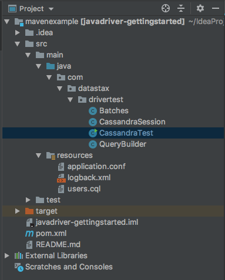

# Getting Started with the Java Driver for Apache Cassandra
This repository was created as a guide to help Apache Cassandra users get started with the Datastax Java Driver

## Prerequisites

* Apache Cassandra® 2.1+
* Maven

## Overview



For this demo, we’re going to be creating a simple console application. This Java project was created with IntelliJ and uses Maven to manage dependencies, with Apache Cassandra 3.11.3 as the database. You will need both the Java Driver core and Query Builder libraries in your POM file. 

   <dependency>
            <groupId>com.datastax.oss</groupId>
            <artifactId>java-driver-core</artifactId>
            <version>4.0.0</version>
        </dependency>
        <dependency>
            <groupId>com.datastax.oss</groupId>
            <artifactId>java-driver-query-builder</artifactId>
            <version>4.0.0</version>
        </dependency>
        
The `resources/users.cql` file provides the schema used for this project.

## Connect to your Cassandra cluster

The entry point to your Cassandra cluster is through the `CqlSession`. It holds the known state of the actual Cassandra cluster, and is what you use to execute queries.`CqlSession.builder()` provides a fluent API to create an instance programmatically. Get a session connecting to the “demo” keyspace. To the `getSession()` method in `CassandraSession.java`, add:
```java
CqlSession session = CqlSession.builder().build();
```
the `resources/application.conf` file contains driver configurations (and defaults that we want to override). Here is where we set the
`demo` keyspace we will be connecting to with our session.

```
datastax-java-driver {
  basic.session-keyspace = demo
}
```

## Simple Statements
In this sample project, we will manipulate enteries in a simple `users` table, using the Java driver. You can use SimpleStatement for queries that will be executed only once.  Now that you are connected to the “demo” keyspace, let’s insert a user into the “users” table. Add the following lines of code to the main method in `CassandraTest.java`.
```java
// Insert one record into the users table
session.execute("INSERT INTO users (lastname, age, city, email, firstname) VALUES ('Jones', 35, 'Austin', 'bob@example.com', 'Bob')");
```

Using the Java driver, we can easily pull the user back out 

```java
// Use select to get the user we just entered
ResultSet rs = session.execute("SELECT * FROM users WHERE lastname='Jones'");
for (Row row : rs) {
System.out.format("%s %d\n", row.getString("firstname"), row.getInt("age"));
}
```

Perhaps it is the user's birthday, so we are going to update their age.
```java
// Update the same user with a new age
session.execute("update users set age = 36 where lastname = 'Jones'");
// Select and show the change
results = session.execute("select * from users where lastname='Jones'");
for (Row row : results) {
System.out.format("%s %d\n", row.getString("firstname"), row.getInt("age"));
}
```

Now let’s delete Bob from the table. Then we can print out all the rows. You’ll notice that Bob’s information no longer comes back after being deleted (others might, if you have inserted users previously).
```java
// Delete the user from the users table
session.execute("DELETE FROM users WHERE lastname = 'Jones'");
// Show that the user is gone
results = session.execute("SELECT * FROM users");
for (Row row : results) {
System.out.format("%s %d %s %s %s\n", row.getString("lastname"), row.getInt("age"),  row.getString("city"), row.getString("email"), row.getString("firstname"));
}
```


## Prepared Statements
Use prepared statements for queries that are executed multiple times in your application. When you prepare the statement, Cassandra parses the query string, caches the result and returns a unique identifier (the PreparedStatement object keeps an internal reference to that identifier).
```java
// Insert one record into the users table
PreparedStatement prepared  = session.prepare(

"INSERT INTO demo.users" + "(lastname, age, city, email, firstname)"
      + "VALUES (?,?,?,?,?);");

BoundStatement bound = prepared.bind("Walsh", 40, "Santa Fe", "kate@example.com", "Kate");

session.execute(bound);
```
## Query Builder
The query builder is a utility to generate CQL queries programmatically. Query Builder, which is more secure than using strings and saves us from potential CQL injection attacks.Add the following code to `executeQueryBuilder()` in `QueryBuilder.java` to insert a user.
```java
// Insert one record into the users table
        Insert insert = insertInto("users")
                .value("firstname", literal("Therese"))
                .value("lastname", literal("Fredriksen"))
                .value("age", literal(26))
                .value("email", literal("therese@example.com"))
                .value("city", literal("Oslo"));


SimpleStatement statement = insert.build();

session.execute(statement);

// Use select to get the user we just entered
Select select = selectFrom("users").all().whereColumn("lastname").isEqualTo(literal("Fredriksen"));

SimpleStatement stmt = select.build();

// Show results
ResultSet rs = session.execute(stmt);
for (Row row : rs) {
   System.out.format("Output from QueryBuilder: %s %d\n", row.getString("firstname"), row.getInt("age"));
}
```

## Batch Statements
Use BatchStatement to execute a set of queries as an atomic operation. Batches can contain any combination of simple statements and bound statements. Add the following code to `executeBatchStatement()` in `Batches.java`.
```java
// Create simple statement to insert a user
SimpleStatement simpleInsert =
        SimpleStatement.newInstance(
                "INSERT INTO demo.users (lastname, age, city, email, firstname) VALUES ('Hicks', 28, 'Denver', 'raquelle@example.com', 'Raquelle')");

// Create prepared statement to insert a user
PreparedStatement preparedInsert =
        session.prepare(
                "INSERT INTO demo.users" + "(lastname, age, city, email, firstname)"
                        + "VALUES (?,?,?,?,?);");

// Create batch statement
BatchStatement batch =
        BatchStatement.builder(LOGGED)
                .addStatement(simpleInsert)
                .addStatement(preparedInsert.bind("Jansson", 30, "Stockholm", "linda@example.com", "Linda"))
                .addStatement(preparedInsert.bind("Gutermuth", 64, "Munich", "david@example.com", "David"))
                .addStatement(preparedInsert.bind("Robinson", 21, "Toronto", "sarah@example.com", "Sarah"))
                .build();


session.execute(batch);
```        
 Finally, uncomment the the final SELECT statment code in the main method to see all the users you have inserted into the table.
 
 ```java
  /*
  ResultSet results = session.execute("SELECT * FROM users");
  for (Row row : results) {
      System.out.format("%s %d %s %s %s\n", row.getString("lastname"), row.getInt("age"),
              row.getString("city"), row.getString("email"), row.getString("firstname"));
      } 
   */
```
